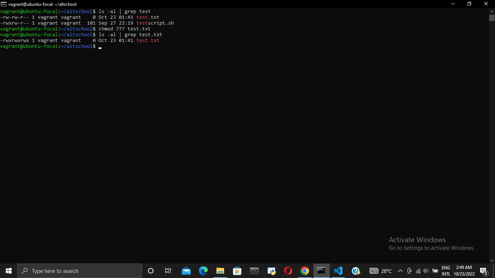

# **EXERCISE TWO: LINUX COMMANDS**
| **S/N** | **COMMAND** | **FUNCTION**| **EXAMPLE**|  
| ----- | ------------- | ------------ | ----------|  
|1.| rm | To remove a file | `rm test.txt` |   
| 2. | sudo | Execute a command as super user | `sudo su` |  
| 3. | su | Change users | `su yomi` |  
| 4. | grep | To extract from a file all lines containing a particular pattern | `cat test.txt | grep altschool` |  
| 5. | chmod | Change the permissions of a file or directory | `chmod 777 test.txt` |  
| 6. | file | Show the type of a file | `file test.txt` |  
| 7. | locate | Find files with names matching a pattern | `locate test` |  
| 8.| apt | Install and manage packages in Ubuntu | `apt update` |  
| 9. | echo | Display line of text/string passed as an argument | `echo pressing` |  
| 10. | ps | List running processes | `ps` |  

**rm** 
  
---   
**sudo**  
  
---   
**su**  
  
---  
**grep**  
  
---  
**chmod**  
  
---   
**file**  
  
---  
**locate**  

---  
**apt**  

---  
**echo**  
  
---  
**ps**  
  

