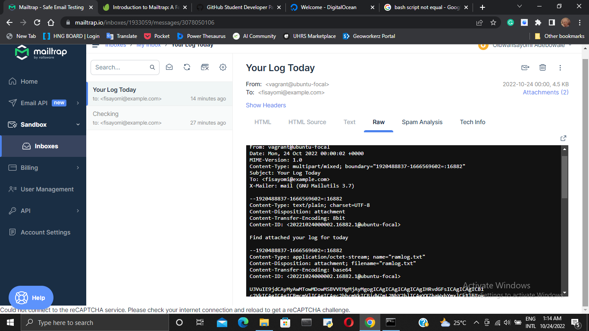
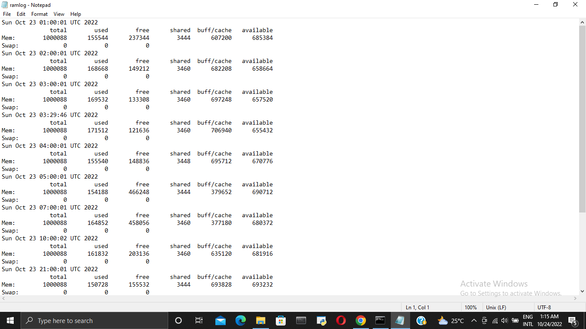

# **EXERCISE EIGHT: CRONJOB**

## Bash Script  
```
#! /usr/bin/bash  
cd /home/vagrant/altschool  
#Email Address Recipient  
EMAIL="fisayomi@example.com"  
# Time Argument  
SENDTIME=$(date +%H%M)  
# Log file   
FILE=$HOME/altschool/ramlog.txt  
if [[ -z $FILE ]];  
then  
        touch $FILE  
else  
        date>>ramlog.txt  
        free>>ramlog.txt  
fi  
# Send Log file for the day  
if [[ $SENDTIME == 0000 ]];  
then  
        echo "Your Log for Today" | mail -s "Ram Usage" -A $FILE $EMAIL  
        rm -rf $FILE  
fi 
```

---

## Cronjob Script
> ` 0 */1 * * * bash /home/vagrant/altschool/initialscript.sh`

---
## Email Received


---
## Ram Usage Log Email Attachment


---
